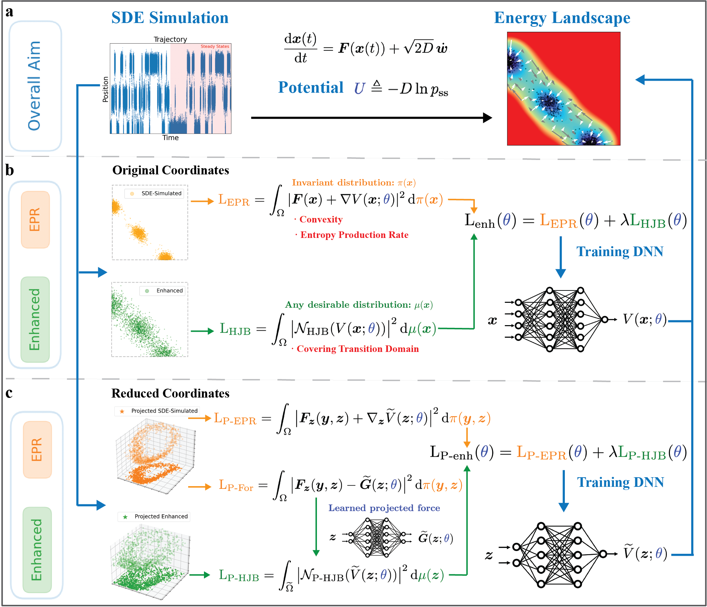

# Introduction

This is a repo for [EPR-Net: Constructing non-equilibrium potential landscape via a variational force projection formulation](https://arxiv.org/abs/2301.01946).


# Environment

You can create a new conda environment by following the code snippet provided below.

```
conda env create -f environment.yml
conda activate epr-net
```


# How to Run

## Running Scripts
We have organized the running scripts in the `scripts` directory. For example, to execute the 2D double-well example, please employ either of the following commands: 
```shell
sh scripts/benchmark_2d/DW2d_D=0.1_EnhEPR.sh
```
or 
```shell
sh scripts/benchmark_2d/DW2d_D=0.1_HJB.sh
```

The outcomes of these experiments will be stored in the `checkpoints` directory. For real-time monitoring of the training process, the use of `tensorboard` is recommended.

We have also incorporated the [normalizing flow](https://github.com/VincentStimper/normalizing-flows) as a baseline for comparison. To explore this baseline, please refer to the script `scripts/benchmark_2d/DW2d_D=0.1_NF.sh`.

## Problem Settings and Data Generation

All problems are encapsulated within the `Problem` class found in `problems.py`. To introduce your own problem, simply refer to `self.set_problem()` and define its associated dynamics in `self.force()`.

In certain scenarios, you might find it more convenient to use a pre-existing dataset. This dataset can be easily reloaded by bypassing the `--resimulate` flag. Please ensure that the dataset is located in the `samples` directory and adheres to the naming convention like "PID=2010-dim=8-D=0.01.pth" and "PID=2010-dim=8-D=0.01-enh.pth".

## Enhanced EPR Options

The functionality of the scripts can be tailored by tweaking various parameters. Here are some significant options:

- Setting `rho_1=0.0` will cause the algorithm to function under the single EPR formulation.

- Setting `rho_2=0.0` will result in the algorithm solely solving using the Hamilton-Jacobi-Bellman (HJB) approach.

- Assigning non-zero values to both `rho_1` and `rho_2` will activate the enhanced EPR.

You are encouraged to experiment with these parameters to examine different configurations and observe their impact on the results.